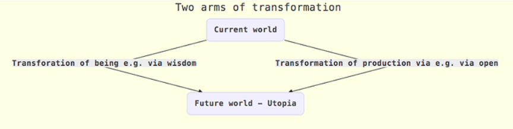

# Ideas and Concepts

Below are the key ideas and concepts in which the work of Life Itself is grounded.

## Four Kinds of Problem

*Rufus Pollock*

There are four types of problem. There are problems of:

* **Science/tech:** knowing what the answer is (e.g. how does global warming happen and how do we prevent it?)
* **Preference (or self-knowledge):** knowing what we really want – do I want to watch this boxset or do my meditation? Do I really want to eat this donut or do I want this salad? Do I want to make sacrifices now to reduce climate change so my daughter faces fewer risks in thirty years?
* **Will (or self-control):** we know what we want, but we struggle to act on it (I want to go on a diet but I don’t, I want to avoid long-distance flights to save C02 but I also want to go on that holiday in the Caribbean).
* **Collective (collective action):** we need to act together to solve these problems (e.g. I want to stop global warming by reducing carbon emissions but on my own I will have no impact – I need millions of others to act with me…)

We have four types of solutions associated to each problem type ⁠— sciento-technic solutions, those targeting self-knowledge or will and finally those addressing collective action (“politico-economic”).

Note: a given “problem” may be comprised of aspects belonging to  one or more of these four categories.

## Technosolutionism

All our techno-scientific advances in recent centuries have only helped with the first type of problem. We are currently suffering from a fetish of “techno-solutionism,” where we mistakenly assume that all problems are of type one (or can be solved by type one solutions).

This is because type one problems are relatively easy: we can do science, build apps, etc. Solutions to the last three, on the other hand, all involve deep questions of the human spirit and social organization. “Innovation” in these areas is very slow – for example, democracy (a solution on the 4th item) is basically unchanged since Ancient Athens.

I would argue that progress on the last three really comes from the “transformation of being,” and that we do have answers here, they just aren’t easy to follow. They are based on the ontology and practices found in traditions like Buddhism (which are currently rapidly spreading in the form of mindfulness). Following these practices requires willpower and the results are not easily replicable (just because I get enlightened does not mean you do, whereas if I invent a better way to grow corn you can copy it easily). Unfortunately for us, science / tech solutions seem to help little with the other three items and as we get richer the value of science / tech solutions are less and less important 

I discuss the way techno-solutionism is inflating our expectations of the benefits Open Data alone can bring us here: https://blog.okfn.org/2012/09/13/managing-expectations-ii-open-data-technology-and-government-2-0/

You can read a longer look at techno-solutionism in the context of Bitcoin here: https://docs.google.com/document/d/1GmqQTS9IHK1maLFmv8oJjDVs66x8woa3g8MiUXoH1-s/edit

## The Two Arms of Transformation

*Rufus Pollock*

### Big picture

Seeing the big picture is important if we are to understand our purpose and direction. The big picture is that there are two arms of transformation: the first is the transformation of the material economy (transforming production through openness, etc.) and the second is the transformation of the “being” economy (through wisdom and true open-mindedness).

### Transformation of Production / Material Economy

Our work on open knowledge is intended to transform the material economy. This is the area that my book [*The Open Revolution: Rewriting the rules of the information age*](https://openrevolution.net/) focuses on.

### Transformation of Being / Spiritual Economy

The transformation of the "being" economy is the more important in my opinion ⁠— and the part we have tended to neglect as a society.

This is the impetus behind Life Itself; to hold an enquiry into how we can cultivate wisdom on a personal and collective level and to take practical action towards this goal.

## Primacy of Being

## Middle Way

Life Itself seeks a middle way, one which synthesises the best qualities of spirituality and pragmatism, engagement and reflection. You can read more [here](https://lifeitself.us/2018/06/22/synthesis-and-the-middle-way/).

## Sketches of a Future Society

Read our vision of a better future [here](https://lifeitself.us/2017/06/13/sketches-of-a-future-society-part-one/).