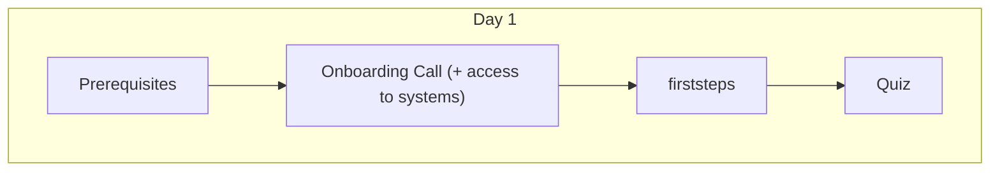
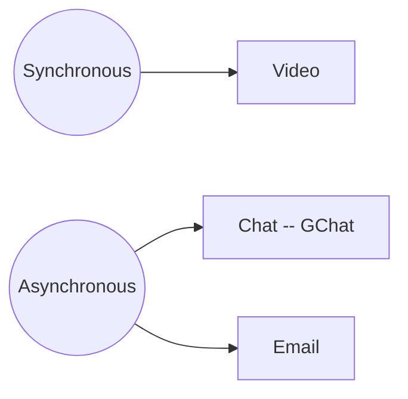

# Onboarding Guide

Welcome to Life Itself! 👣 🌱

This guide provides you with a simple step by step process to get set up at Life Itself so that you are ready to go. We have designed it to be largely self-service so you can do it on your own, at your own pace.

:::tip
We want **your** feedback to help make this handbook better: be critical, tell us what we could improve! You can make corrections directly by using the edit link at the bottom of each page (they will get reviewed before they go live!) or add comments with Hypothesis (a web annotation tool that you can use to annotate this guide - we'll cover this in more detail soon).

:::

Some of the links you'll see in this guide will take you to the onboarding guide for Datopian, an organisation that collaborates with Life Itself and shares much of the same culture.

## Onboardee Journey Overview

This diagram illustrates how you should work through this onboarding process. Each stage will be covered in more depth further on in the guide.



<mermaid />

## Prerequisites 

Before we get to the onboarding proper there are some essential prerequisites to get yourself set up.

Please complete as many of the following steps as you can on or before your first day, progressing through them in the order that they're written. 

Don't worry if you get stuck, as you will be able to ask your Onboarder questions during your onboarding call. 

Note: you will need to have been granted access to your Life Itself email account before you are able to complete all of the prerequisite steps. If you're not given access to your Life Itself email before your onboarding call, please do as many of the prerequiste steps as you can.

### 1. Log in to your Life Itself Email

The first thing you need to do is log in to your Life Itself email account.

You will receive an invitation to your personal email with details of how to sign in to your Life Itself email account and set your password.

Sign in and check your account for any email you may have already received.

### 2. Set up systems

You now need to create an account on each of these. Please make sure you set up Gravatar first. 

When you set up systems, try to pick usernames that will be easy for others to remember (e.g. using your first and last name is ideal).

* Gravatar -- https://gravatar.com. **You need to this before anything else so your Gravatar is used on the other accounts you create.** 
	* To be able to create a Gravatar, you have to create a WordPress account first. 
	* You can then create a Gravatar so that your profile picture will show up automatically on your profile on other systems. 
	* When you create your Gravatar, add your Life Itself email and *all* the email(s) you will use on other accounts.
	* [If you get stuck, you can read more about Gravatar here](https://wordpress.com/support/gravatars/)
* Github -- https://www.github.com
* GitLab -- https://gitlab.com.
	* At Life Itself we use Github and Gitlab for collaborating on projects and deploying our website. 
* HackMD -- https://hackmd.io.
	* HackMD is a tool for collaborating on documents with others (it's a bit like Google docs, but it uses a language called MarkDown, which we'll look at in more detail later in the onboarding process).
* Hypothesis -- https://web.hypothes.is/start/
	* Hypothesis is a web annotation tool that you can use to annotate this playbook with questions, comments and corrections. Once you've finished the onboarding process, let your onboarding mentor know if you've made any comments in hypothesis and link them to your comment stream because 

### 3. Add your details to the phonebook

Next, please add your details to our [Phonebook / Person DB form][googleform]. -- **Note:** you will need to be logged in to your Life Itself email account to do this.

### 4. Set up your laptop

[Setup your laptop as per these instructions](https://playbook.datopian.com/laptop-setup/#remote-pair-programming).

### 5. Initial Reading

We also recommend you look at the reading below as part of your onboarding:

* Read [The Tao of Life Itself](https://tao.artearthtech.com/#how-to-read-the-way) for an introduction to how the principles behind Life Itself.
* Check out [The AET style guide](https://docs.google.com/document/d/1brIruLlj1UzqwwdBBlCwv2UXN8XaS7rGgE-OWRldYSE/edit) for an introduction to our writing style.

You can also have a quick look around https://artearthtech.com/.

## Onboarding call

You'll start your first day with an onboarding call, during which you can ask questions and get access to any systems you haven't already been able to access.

In order to get to know one another better, we might ask you to introduce yourself using the 'once upon a time' structure. This reads as follows: "Once upon a time there was ___. Every day, ___. One day ___. Because of that, ___. Because of that, ___. Until finally ___."

### Meet your Mentor / Buddy

Usually, you will have a mentor/buddy to accompany you in your journey to being a full fledged member of Life Itself. 👣 🌱 If they haven't already arranged a meeting with you, ping them on your first day via chat and arrange something. 😃

---

## First Steps

### Set up GitLab account

We use GitLab https://gitlab.com/ for a lot of project management as well as managing our code in git repositories. We want to introduce you to it here briefly because we will use its issue tracker functionality.

The issue tracker is space for storing and sharing task lists - you can think of it as an online notebook full of to-do lists. You can create an issue within the issue tracker to outline all the subtasks associated with something you're working on. Updating the issue records your progress and keeps your team up-to-date.

It's fine if you are unfamiliar with GitLab -- you only need the basics for now.

You can read this [tutorial](https://docs.gitlab.com/ee/gitlab-basics/) in your own time.

### Set up Github account

We also use Github, though less actively, and primarily for our open-source, public codebases.

The only thing to do here is to publicly display your Life Itself membership, see [Publicizing or hiding organization membership](https://help.github.com/en/github/setting-up-and-managing-your-github-user-account/publicizing-or-hiding-organization-membership).

### Set up HackMD account

We mostly use HackMD for developing documents, not only because it's free but also because it allows several team members to co-work at the same time! HackMD also gives you the output real-time and you can easily copy and paste the markdown text into another interface/platform (e.g. GitLab) by keeping the same format.

Frequent senarios to use HackMD with the team:

* as a scratch pad for brainstorming to generate ideas for a project or a document;
* as an essential document to co-work on a project with team members;
* as a draft for GitLab issues;
* as a draft before git commit, etc.

Let's try it out here: https://hackmd.io/

_Note:_ _For meeting docs, you will want to use Google Doc, not HackMD._


### Create an Onboarding Issue

You are going to track your onboarding progress using a Gitlab issue in the onboarding project. [Click here](https://docs.gitlab.com/ee/user/project/issues/) for more information on Gitlab issues. 

* Please go to: https://gitlab.com/artearthtech/dojo/onboarding
* Create your own GitLab issue and use it to track your Onboarding progress. Name it like `Onboarding {First Name} {Last Name} {Date}`
* Copy and paste the checklist below into your GitLab issue and modify it/add more learnings to it while going through the Onboarding process (eg. Markdown, HackMD, GitLab, etc.).

```md
This is my exciting onboarding issue! 🌱

## Onboarding Essentials

### Prerequisites

* [ ] I have access to Life Itself email
* [ ] I have set up accounts on all the systems
* [ ] I have submitted my bank account details
* [ ] I have submitted my details via the Phonebook form
* [ ] I have set up my laptop

### First Steps

* [ ] Have created this issue in GitLab :smile:
* [ ] Hypothesis working in my browser and have created (and then deleted) one test annotation on this website
* [ ] On GitHub I have made my membership of Life Itself public @ https://github.com/orgs/life-itself/people and it's visible on my profile and on https://github.com/life-itself
* [ ] I have access to GDrive
  * [ ] Have created my Email signature
  * [ ] Doc Styles are set. Test by creating a google doc in apprentice folder and see that default doc styles are automatically applied (you can delete this document afterwards).
* [ ] Calendar
  * [ ] [settings] Add working hours
  * [ ] [settings] Check if your time zone is correct
  * [ ] Created a calendar meeting
  * [ ] Invited one or more other people to it
  * [ ] Deleted it
  * [ ] Add any days to your and the team calendar in next 2 months in which you will be away (delete these afterwards if inaccurate).
  * [ ] Confirmed I have the daily standup between 8.45am-9am UKT (9.45am-10am CET) in my calendar
* [ ] How we communicate
  * [ ] Go on Gchat and message each other directly
* [ ] Standups
  * [ ] Write a standup in the onboarding channel (Plan, Recap, Blockers (if any), Availability)
  * [ ] Check out the "standups" channel (don’t post there for now)
* [ ] Meetings
  * [ ] Create a meeting doc in the [onboarding practice folder](https://drive.google.com/drive/u/0/folders/1XbKO6_IbTLXu6-OVTzpPYJgJ_Hzn8Lxv)
  * [ ] Structure the document according to the recommendation. Do as if you were going to introduce someone to the place where you live
  * [ ] Post the link to the meeting doc on the onboarding chat and ask for it to be reviewed
```

### Set up Google Drive

After setting up your email address, you will have access to **GSuite**, and of course, [Google Drive](https://drive.google.com/drive/).

The Onboarder will have granted you access to relevant Team Drives, so you can access and store the information / documents you require.

* Any new documents / sheets /presentations you create should be created in the appropriate folder in the Team Drive, **not your personal drive**. This speaks to our open and collaborative working culture and avoids having to explicitly share files with people.
* If you require access to files that you currently don't have access to, please reach out to your Onboarder.

#### Create your E-mail signature

Please implement this [E-mail signature template](https://docs.google.com/document/d/1gpw5zucdlA_tU5geFpIs89AxuJ0is8kMEh6mIDkttnY/edit) into your gmail account.

#### Install default styles

We want our documents to look neat and coherent so we set up default styles for Life Itself. Follow the steps below to set up default styles for your documents in Drive.

* Go into  [Doc Style Template](https://docs.google.com/document/d/1f_k9PSY44CXi39Pm9jKBmXdjsD1N0PpjPVtqE-HHhb4/edit#) 
* Then, click the menu item *Format → Paragraph Styles → Options → SAVE as my default styles*

Test it:

* Create a new document
* Start writing.
* Check the styles are correct: compare with the styles in the template.

### Organise your Calendar

You have been given access to create, edit and share in Life Itself Team calendar. We use the team calendar to track people's holidays and business trips.

It is expected that you keep your calendar up to date, so that if it shows as free, that means a colleague can add a meeting during that period.

#### Set Your Working Hours

Set your working hours in the Google Calendar settings so that people automatically get warned when they try to schedule a meeting outside of your working hours.

For instructions on how to set your working hours, see:

https://support.google.com/calendar/answer/7638168?hl=en

Working hours are according to the primary time zone you have set in Google Calendar.
For info on where to find your primary time zone in the settings, see:

* https://support.google.com/calendar/answer/37064?hl=en&co=GENIE.Platform=Desktop

#### View your teammates' calendars

* To see someone else's calendar, see others' calendars side by side or find a time that someone is free, see: https://support.google.com/calendar/answer/6294878?co=GENIE.Platform%3DDesktop&hl=en
* You can also add the calendars of the teammates you're mostly working with so you can easily see their availability. For instructions, see https://support.google.com/calendar/answer/37100?co=GENIE.Platform%3DDesktop&hl=en

::: tip
We have a weekly all hands, this will be in your Life Itself calendar once you sign in to your email.
:::

### Complete the Markdown tutorial

Markdown is a markup language with plain text formatting syntax. We often use markdown language based tools, including HackMD and GitLab.

If you are new to Markdown, see the [Markdown tutorial](https://playbook.datopian.com/markdown/#why-markdown).

### Familiarise yourself with Version Control and Git

We use Git to manage code and also a lot of content.

See the [Git Basics](https://playbook.datopian.com/version-control/#introduction) for more information, including an introduction for those new to the topic. 

## Communication

*As a virtual organization we need to have efficient, reliable, cost-effective ways to communicate and share material.*

### Getting Help and Finding Stuff

We're fully remote so our equivalents of all the standard office chatting takes place online either in Chat 💬 or on video calls. 📺

So if you need help 🙋 or just want to hang out, here's a list of the best places to start:

* [Onboarding channel](https://chat.google.com/room/AAAAQmJneCg) -- May be the best place for you right at the start.
* [The Watercooler](https://chat.google.com/room/AAAAVJ0Vn3Q) -- If you just want to hang out.

Also, you can just message anyone direct and they'll be happy to help -- we are a friendly bunch. 🤗

### Communication Tools



#### Google Chat
[Google chat](https://chat.google.com/) is the main channel we use to communicate with our team members. 

It is an online networking platform (you can also download the app) where we have different rooms for different projects/purposes.

Based on our transparency policy, we require people to speak publicly in the related group and @ the people you want to talk instead of texting privately, unless it is a personal chat.

Any project information or artifacts (e.g. README or technical specs) should be kept on the drive and not on Google Chats. **We use Google Chats as a communication platform and not a knowledge management platform.**

_Once you have your Google Chat accounts, please let your Onboarder know and they will add you to the appropriate channels for your role and introduce you to everyone._

#### Voice / Video calls
Our default tool for video is Zoom (although sometimes we also use Google Hangouts). Video call links are automatically added to every meeting and are set up using our Google Apps calendar.

  *Face to face communication is a big deal for humans. Facial cues are very important. Always prefer video over voice for synchronous.*

#### Email
We use Gmail.

#### Documents
We use Google Drive for all internal documents. We also use HackMD.

### Standups

Standups are part of the [agile methodology][agile]. Agile is a project management tool, and standups are a way of outlining what you intend to work on that day. Their purpose is to:

* Keep the team in sync
* Identify blockers 
* Deal with issues arising (e.g. need to reprioritize in the face of an arising issue or change in estimate)

Traditionally, standups are done verbally "in person" (in a live team meeting e.g. on video). Life Itself holds standup every weekday at 9:45 CET. However, we have found it useful[^why] to provide the standup in a written form and post it on chat. Thus, team members SHOULD provide a daily *written* "standup" update on the Standup channel on chat. The form of standup, either written or verbal, is as follows:

[^why]: Why have we found this useful? First, written updates are easier to follow. Second, if some team members can't make standup they can still get the updates.

* Plan (What is your plan for today?)
* Recap (What did you accomplish yesterday?)
* Blockers (Is there something getting in the way for you to complete your tasks)
* Availability (What is your availability for today?)

```md
* Last 24h: ...
* Next 24h: ...
* Blockers: ...
* Availability: ...
```

### Meetings

Make sure to familiarise yourself with our [meeting protocol](https://playbook.datopian.com/meetings/#why-start-on-time). 


## Quiz

Finally, have some fun and complete the onboarding quiz to test your new-found knowledge (and help improve this onboarding guide).
* Non-tech folks, please click [here][non-tech quiz].

⏰ Please spend max 15 -- 30 min on this!

[quiz]: https://docs.google.com/forms/d/e/1FAIpQLSdtKZ9D4YpDDJ39HfPUniBcCuiLZ1c92Ri7LvE9nudgs_ZzMg/viewform
[non-tech quiz]: https://docs.google.com/forms/d/1yE895I0JVGujXS-2scuODOOxssAI5roDK6YU-Rw5n70/viewform

<mermaid />
