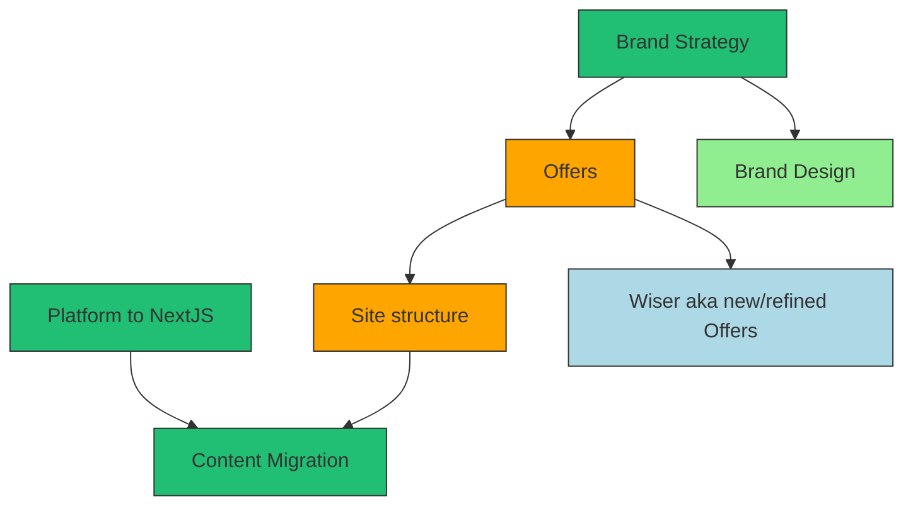
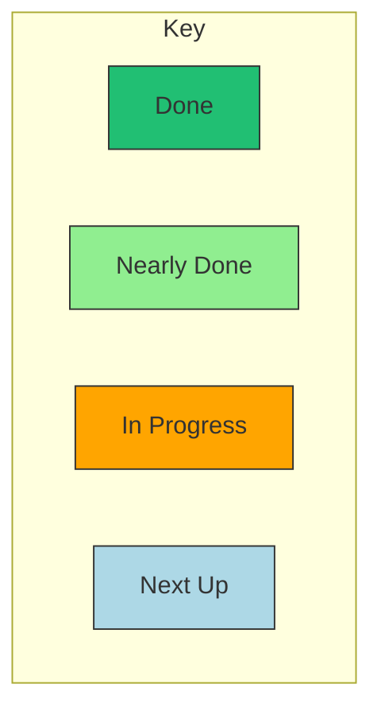
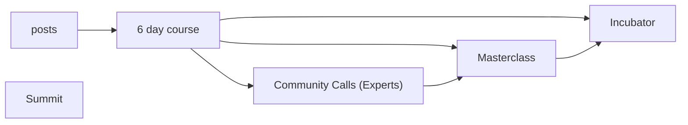

3rd major revision of Life Itself strategy along with implementation thereof.

## Key Documents

- [Life Itself V3 A10](https://docs.google.com/document/d/1lxWWI4IvnWPLPtQjLY2_fGkko99MnqIDKMCD6E-uDaQ/edit#)
- [Life Itself V3 SCQH](https://docs.google.com/document/d/1vnWtHxNkahW_r2FcpJMYEs-Fvv8dhrJnisqAeewHjP8/edit#)

## Acceptance

- [ ] A10 completed **🚧2022-11-20 [A10](https://docs.google.com/document/d/1lxWWI4IvnWPLPtQjLY2_fGkko99MnqIDKMCD6E-uDaQ/edit#) - 50% done**
- [ ] Strategy complete
- [ ] Offers finalized
- [ ] Implementation

## Tasks

### Strategy

- [ ] SCQH including issue tree
  - [x] SCQH itself for v3 **🚧2022-11-20 90% - just need to tidy and make sure hoisted [SCQH for v3](https://docs.google.com/document/d/1vnWtHxNkahW_r2FcpJMYEs-Fvv8dhrJnisqAeewHjP8/edit#)**
  - [x] Build an issue tree **🚧 Issue Tree under construction https://coggle.it/diagram/Y3IJZ_nDY3PfaFPG/t/life-itself-v3-strategy-revision-what-is-level-so-that**
  - [ ] Move issue tree to spreadsheet and prioritize etc
  - [ ] Start answering
- [x] Hypothesis and key answers **✅2023-01-04 School of Life onto-flavored and a focus in 2023 on conscious coliving and communities**
  - [ ] High level strategy revision if any. Revisit, finalise & complete [#36](https://github.com/life-itself/community/issues/36)
       - [ ] [Consolidate SCQHs and map hierarchically ](https://docs.google.com/spreadsheets/d/1x4czK3jC7-QopHoGma_VcRgaXuUyDDa118m18l__d8M/edit#gid=0)  
  - [ ] Determine key audience, needs and offers of Life Itself "v3"? **🚧2022-11-10 overview in progress**: https://app.excalidraw.com/s/9u8crB2ZmUo/3zBZWBXlUFv see also [Job Stories 2022](https://docs.google.com/document/d/104O3fDi5WWfelkubuFDgvxJj0drOwsbVFxvV7slq_Nc/edit?pli=1#heading=h.yuktds5l6634)
  - [ ] Brand revision [#162](https://github.com/life-itself/community/issues/162) 
  - [ ] Create Roadmap
    - [ ] Where are we going?
	- [ ] What are the interim checkpoints? 
	- [ ] What are the timelines? 
	- [ ] What are the needs, and processes to fulfil them?
	- [ ] Who is accountable for what?

### Implementation

- [x] New and improved website [#170](https://github.com/life-itself/community/issues/170)  [LifeItself.org migration and update 2022 - [A10] README](https://docs.google.com/document/d/1fhl4quGen3KmglOYzfG6MXAbk7yR2H87weeN8ACqxBg/edit#)
  - [x] Platform: new platform **✅  We have moved to Flowershow**
  - [x] Content migration **✅  28-12-2022 tracked by [#184](https://github.com/life-itself/community/issues/184)**
    - [x] Tao **✅ merged into /tao and refactored where appropriate [#182](https://github.com/life-itself/community/issues/182)** 
    - [x] Sutras **✅ merged into /sutras**
  - [ ] Content refactor [#223](https://github.com/life-itself/community/issues/223) 
- [ ] Brand Implementation [Brand Update 2022 - P2203 - [A10] README](https://docs.google.com/document/d/1edZUkd3O3nxIBCeX8xb-Yvra3Q_xmStunNYHwarKogA/edit#heading=h.599vpyhb8naq)
- [ ] [Wiser 2022 - P2201 - [A10] README](https://docs.google.com/document/d/1X9NebAIhxtQMIa4dYcD7KO3BWcMg9AfSs_lKyputA0k/edit#)
  - [ ] [Wiser Newsletter - P2218 - [A10] README](https://docs.google.com/document/d/12GLL3ljWZem1zXBec_na_vRlAoRhiu-dLAcQHGoMlK4/edit#heading=h.599vpyhb8naq)
  - [ ] Wiser Portal TODO

### Inbox

- [x] Check out [#118](https://github.com/life-itself/community/issues/118) and work out if it merges with this (and relation with [#36](https://github.com/life-itself/community/issues/36))~~ **✅ Merged [#118](https://github.com/life-itself/community/issues/118) here and [#36](https://github.com/life-itself/community/issues/36) is linked to a task above** 
- [ ] Consolidate the various strategy docs floating around
  - [ ] list them **🚧2022-11-20 most are in [v3 strategy folder](https://drive.google.com/drive/folders/1_Dq-lY7dd3cmt_BtbqIlJ9SUddaa0hNS) e.g. [Big Strategy - Revised mid 2022 (extracted from work in Wiser A10 originally)](https://docs.google.com/document/d/18X9GAgGpcGVP01C0Vkvk9OSUHLDcGsMrvyQ8zLE-n4o/edit#heading=h.2c73sxj4mua6), v3 Strategy SCQH etc**
  - [ ] ~~connect pre-existing high level SCQH revision epic: https://github.com/life-itself/community/issues/36~~ **✅ added above**

## Big Plan Sketches as of Summer/Autumn 2022

3 streams

- Conscious coliving communities (incubator for coliving)
- Sangha / Community (shambhala warriors)
- Lighthouse: books, podcasts, etc

